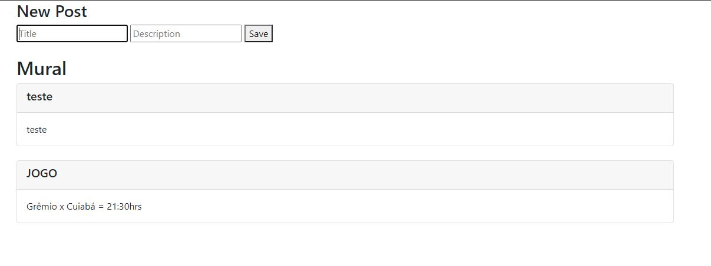

# Mural de Avisos




* Mural de Avisos


## 💻 Pré-requisitos

Antes de começar, verifique se você atendeu aos seguintes requisitos:
* Você instalou a versão mais recente de `NODE`


## ☕ Usando <Mural de Avisos>

Para usar <Mural de Avisos>, siga estas etapas:

```
NPM START
```


